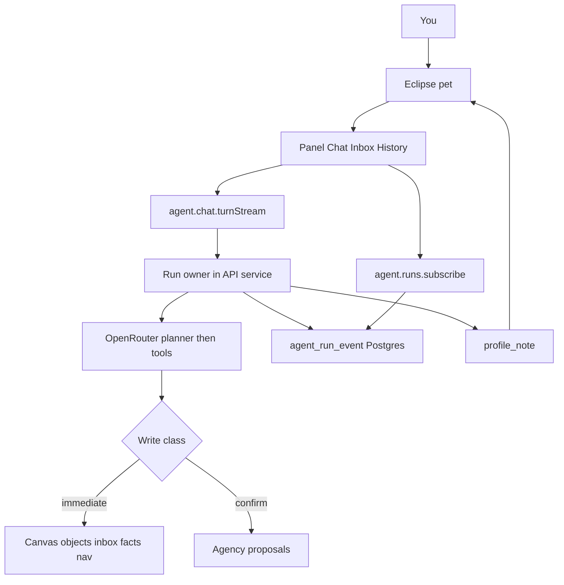

# Orch Personal Assistant Implementation Plan

> **For agentic workers:** REQUIRED SUB-SKILL: Use superpowers:subagent-driven-development (recommended) or superpowers:executing-plans to implement this plan task-by-task. Steps use checkbox (`- [ ]`) syntax for tracking.

**Goal:** Replace the current Ask/Plan/Agent dock + `ui_present` stack with one you-only personal assistant that keeps working after tab close, remembers you, and lives as the Eclipse pet plus one panel.

**Architecture:** The API service owns `agent_run` + `agent_run_event` in Postgres. OpenRouter continues when the WebSocket dies; the client only subscribes. Memory (inbox / facts / observations) injects into a ~20-message window. A planner pass then tools; Agency data writes confirm; Canvas-for-you applies immediately. The web process never imports the `@orch/agent` barrel.

**Tech Stack:** Bun, Drizzle/Postgres, oRPC live WebSocket (`/rpc/ws`), `@orch/agent` OpenRouter loop, TanStack Query, `useChat` + copied Vercel AI Elements (not assistant-ui), shadcn, Eclipse SVG from [`apps/web/public/favicon.svg`](apps/web/public/favicon.svg).

## Global Constraints

- Golden-file flow only: schema → API schemas → router → `service(actorUserId, input)` → hook → container → view. Views never call oRPC/stores/auth.
- Browser may import `@orch/agent/types` and `@orch/agent/model-routing` only — never `@orch/agent`.
- IDs via `createWorkspaceId(prefix)` from `@orch/workspace`.
- No BullMQ / extra worker process. Follow [`apps/server/src/lib/notification-digest.ts`](apps/server/src/lib/notification-digest.ts) `setInterval` for later detection.
- Models: only `openrouter/auto-beta` or `openrouter/free`, chosen by budget (not Fast/Balanced/Pro, not a model picker).
- Kill: `ui_present`, `ask_agency_question`, Ask/Plan/Agent modes, assistant-ui chrome, `runTaskAgent`, canvas/knowledge proposal rows, message `artifacts` JSON (after slice 4).
- Keep: oRPC WS transport, existing Agency tool catalog (minus killed tools), Agency confirm bus, 20-message window, per-task Orch thread (lazy).
- You-only: conversations, runs, inbox, facts, observations are actor-scoped. Team data is a tool, not a shared agent.
- Eclipse is favicon geometry (disc + Operator Violet bite-dot), not a robot/orb/sparkle. Panel is Operate-mode inside the existing DESIGN.md world.
- Slice 1 must keep the current dock working: add `runId` + reconnect without waiting for the pet UI.
- Commands: `bun test <file>`, then `bun run check`, `bun run check-types`, `bun run check:conventions`, `bun run check:golden` when adding in-scope files.
- Conventional commits (`feat:`, `fix:`, `refactor:`, `docs:`). Default branch `dev`.

---

## Scope check (six sequential plans)

This is not one 2-minute-step rewrite. It is a **program of six independently shippable slices**. This document is the master architecture + Impeccable shape contract. **Slice 1 is the only slice specified to writing-plans TDD depth here.** After Slice 1 ships, write the next slice file at `docs/superpowers/plans/2026-09-16-orch-assistant-slice-N-<name>.md` against the locked interfaces below — do not invent a second architecture.

After this plan is approved, save it to [`docs/superpowers/plans/2026-09-16-orch-personal-assistant.md`](docs/superpowers/plans/2026-09-16-orch-personal-assistant.md) before coding.



---

## Architect synthesis

### Problem

Today `streamDashboardConversationTurn` in [`packages/api/src/routers/agent/service.ts`](packages/api/src/routers/agent/service.ts) passes the **client AbortSignal** into `streamDashboardAgent` (~line 1040). [`OrchTurnStreamTransport.reconnectToStream`](apps/web/src/features/workspace-agent/orch-turn-stream-transport.ts) returns `null`. Closing a tab kills the model. `ui_present`, Ask/Plan/Agent, and assistant-ui are the current product surface. The new product is a living assistant, but the first shippable change is **run ownership**, not a UI rewrite.

Constraints that crossed the boundary: oRPC generator on `/rpc/ws`, golden-file `service(actorUserId, input)`, no job queue, Railway single server process with `setInterval` side effects in [`apps/server/src/app.ts`](apps/server/src/app.ts), wire events already live in [`packages/agent/src/types.ts`](packages/agent/src/types.ts).

### Usage (caller's view)

```ts
// Web: send a turn. First event now includes runId. Closing the WS does not cancel the run.
for await (const event of client.agent.chat.turnStream(input, { signal: tabSignal })) {
  if (event.type === "started") remember(event.runId, event.assistantMessageId);
}

// Web: tab came back. Replay then tail. tabSignal still must NOT cancel the run.
for await (const event of client.agent.runs.subscribe(
  { runId, afterSeq },
  { signal: tabSignal },
)) { /* same event union */ }

// Web: user hit Stop.
await client.agent.runs.cancel({ runId });
```

The UI never sees OpenRouter types, Drizzle rows, or in-process subscriber maps.

### Shape (chosen)

**Deep module: run owner** in API (`packages/api/src/routers/agent/run-service.ts`), not a new package, not a pass-through around `streamDashboardAgent`.

Hides: event persistence, token coalescing, process-local AbortController for OpenRouter, subscriber fan-out, stale-run recovery, the rule that **WS abort ≠ run cancel**.

Exposes four operations:

- `startChatRun(actorUserId, input: StartChatRunInput): AsyncGenerator<AgentChatTurnStreamEvent>` — existing `turnStream` keeps this name at the router; internally it starts a run then yields from subscribe.
- `subscribeRun(actorUserId, input: { runId: string; afterSeq: number }): AsyncGenerator<AgentChatTurnStreamEvent>`
- `cancelRun(actorUserId, input: { runId: string }): { status: "cancelled" }`
- `getRun(actorUserId, input: { runId: string }): AgentRunRecord`

**Invariants encoded in types**

- `AgentRunKind = "chat" | "detection"`
- `AgentRunStatus = "queued" | "running" | "succeeded" | "failed" | "cancelled"`
- `AgentRunEvent.seq` is monotonic per run, unique `(runId, seq)`
- `started` events include `runId`
- Client `AbortSignal` is typed on subscribe/turnStream as **listener lifecycle only**. Cancel is a separate procedure.

**Storage**

- `agent_run` and `agent_run_event` in new [`packages/db/src/schema/agent.ts`](packages/db/src/schema/agent.ts) (do not bloat [`workspace.ts`](packages/db/src/schema/workspace.ts)).
- Token events coalesce: flush at 50ms **or** 32 chars, whichever first. One `token` row can carry a larger `delta`.
- In-process `Map<runId, AbortController>` owns the OpenRouter abort. Events are the source of truth in Postgres so subscribe works after a new WS.
- On server boot: `recoverStaleRuns()` marks `running` rows with `heartbeatAt` older than 2 minutes as `failed`.

**Deliberately not in this shape**

- Redis streams, BullMQ, a second worker dyno.
- Splitting “persist” and “reconnect” into two public APIs (temporal decomposition).
- Leaking OpenRouter `ChatCompletion` types into web.
- Replacing assistant-ui in Slice 1.

### Synthesis decision

Two structurally distinct candidates:

1. **Postgres run owner + in-process OpenRouter (chosen).** Deep interface, no new infra, matches L7, works with existing oRPC WS.
2. **Redis stream + detached worker.** Hides OpenRouter from the API process but leaks Redis/stream types or forces a second public protocol, and we have no job queue. Rejected.

A third non-contender, “keep abort-on-unmount and persist only the final message,” fails the product (sessions still die).

Screened against architect red flags: a wrapper that only forwards `streamDashboardAgent` would be a pass-through — the run owner must own persist/subscribe/cancel/coalesce/recovery. Wire events stay product-shaped (`started` / `token` / `tool` / `error` / `completed`); OpenRouter stays behind `packages/agent`.

### Tradeoffs accepted

- We accept **lost in-flight OpenRouter work on process crash** in exchange for no worker. Recovery marks the run failed; the user retries.
- We accept **polling ~100ms** for subscribe tails in exchange for no LISTEN/NOTIFY.
- We accept **one running chat run per conversation**: a new send cancels the previous chat run, then starts a new one.
- We accept **event-row growth** in exchange for reconnect fidelity; coalescing is the mitigation (YAGNI: no blob compaction until measured).

### Alternatives considered

- Redis event tail: deeper infra, shallower product interface (callers would learn stream IDs). Lost.
- Persist-final-only: tiny public surface, hides the wrong thing (reconnect still empty). Lost.

### Next implementation step

Write failing tests for “client abort does not set `agent_run.status = cancelled`,” then schema + run owner until that passes.

---

## Impeccable shape (Operate, established world)

Shape owns discovery, not code. The visual world is **already chosen**: DESIGN.md Operator Violet + Eclipse favicon. This is a **new surface inside an established world**, not a replacement identity. **Do not run `concept-seed.mjs`.** Do not rewrite DESIGN.md until Slice 5 finish-review.

Write this brief to `apps/web/.impeccable/surfaces/workspace-agent.md` at the start of Slice 5 (and copy it into the master plan file now):

- **Visitor mode:** Operate.
- **Audience / scene:** You, during Agency and Canvas work, often leaving the tab mid-turn.
- **Job:** Always know whether Orch is idle, working, done, or needs you; open one panel to talk, read inbox, and jump history; confirm Agency writes without hunting a second dock.
- **Primary action:** Click Eclipse (~48px, corner) to open the overlay panel. Pet stays on screen while the panel is open (Obvious-style origin).
- **Panel topology:** ChatGPT-like thread + composer (center); Copilot-like rails **Chat | Inbox | History**. No Ask/Plan/Agent tags. No model picker. No quota/voice/MCP demo chrome.
- **Pet moods (from Eclipse canvas):** idle, working, done, needs-you (unread inbox / pending Agency confirm), error. Occasional one-liner from the latest inbox note. `prefers-reduced-motion` snaps, no orbiting.
- **What I created:** real Canvas node/block cards with Open, not generative `ui_present` canvases.
- **Confirms:** if the panel is open, in-thread Approve/Reject; if you were gone, inbox note + needs-you mood.
- **Task pages:** human task chat stays; pet lazily opens a you-only Orch thread for that `taskId`. No `runTaskAgent`.
- **Anti-goals:** robot/orb/sparkle mascot; liquid glass; assistant-ui Thread chrome; burying Orch in Settings; changing Agency rail / Tracker / Bills visuals.
- **Memorable moment:** Eclipse goes needs-you and a one-liner appears; click opens that inbox note.
- **Color:** Restrained — shell neutrals plus Operator Violet `#5b5bd6` on the bite-dot and working/needs-you states only.
- **Kit (Slice 5):** copy Vercel AI Elements into `apps/web/src/components/ai-elements/` (do not overwrite `@/ui`). Custom pet, inbox, What I created, confirms. Then delete assistant-ui usage from the live composer/thread.

PRODUCT.md currently says the agent is a tool, not a personality. Slice 5 updates that product truth to: **Orch is a you-only Eclipse companion**; Agency/Canvas are tools it drives. Do not treat that as a DESIGN.md world change.

---

## Locked interfaces (all later slices)

These names are the contract. Slice N implementers do not rename them.

```ts
// packages/agent/src/types.ts (product wire, not OpenRouter)
export const AGENT_BUDGET_MODELS = ["openrouter/auto-beta", "openrouter/free"] as const;
export type AgentBudgetModel = (typeof AGENT_BUDGET_MODELS)[number];

export const agentRunKindSchema = z.enum(["chat", "detection"]);
export const agentRunStatusSchema = z.enum([
  "queued", "running", "succeeded", "failed", "cancelled",
]);

export const agentRunRecordSchema = z.object({
  id: z.string(),
  conversationId: z.string(),
  kind: agentRunKindSchema,
  status: agentRunStatusSchema,
  model: z.string(),
  lastSeq: z.number().int().nonnegative(),
  error: z.string().nullable(),
  startedAt: z.string().datetime(),
  heartbeatAt: z.string().datetime(),
  finishedAt: z.string().datetime().nullable(),
});

export type AgentWriteClass = "immediate" | "confirm";
// immediate: navigate, highlight, inbox, facts, observations, Canvas/knowledge objects created for you
// confirm: Agency time/money/projects/tasks/clients/tags mutations
```

Memory (Slice 2) public service:

- `listInbox(actorUserId, input: { unreadOnly?: boolean })`
- `markInboxRead(actorUserId, input: { noteId: string })`
- `upsertFact(actorUserId, input: { key: string; value: string; sourceRunId?: string })`
- `appendObservation(actorUserId, input: { observedOn: string; kind: string; summary: string; evidence?: unknown })`
- `getMemoryForPrompt(actorUserId): { facts: string; recentObservations: string; unreadInbox: string }` — injected each chat turn; still cap conversation messages at 20.

Intelligence (Slice 3): planner-then-tools inside `packages/agent` (two OpenRouter calls, no UI Plan mode). `resolveBudgetModel({ remainingCreditsUsd: number | null; freeToggle: boolean }): AgentBudgetModel`. Kill `ask_agency_question`. Scope chips are focus, not catalog unlocks. Detection scheduler starts `kind: "detection"` runs via the same run owner.

Visuals (Slice 4): remove `ui_present` from [`packages/agent/src/tool-catalog.ts`](packages/agent/src/tool-catalog.ts) and all retry notes. Canvas/knowledge apply immediately; emit `created_object` events (nodeId/blockId) for What I created. Drop `dashboard_conversation_message.artifacts` after UI stops reading them. Restrict `agent_agency_proposal.domain` to `"agency"` and stop inserting canvas/knowledge proposal rows.

Task threads (Slice 6): add `dashboard_conversation.taskId` nullable + unique `(user_id, task_id)` where `task_id is not null`. Delete `runTaskAgent`. Task page stays human chat; pet panel creates/opens the you-only conversation for that task.

---

## File map (Slice 1)

Create:

- [`packages/db/src/schema/agent.ts`](packages/db/src/schema/agent.ts) — `agentRun`, `agentRunEvent`
- [`packages/db/src/migrations/0066_agent_runs.sql`](packages/db/src/migrations/0066_agent_runs.sql)
- [`packages/api/src/routers/agent/run-service.ts`](packages/api/src/routers/agent/run-service.ts)
- [`packages/api/src/routers/agent/run-service.test.ts`](packages/api/src/routers/agent/run-service.test.ts)
- [`packages/api/src/routers/agent/run-abort-policy.test.ts`](packages/api/src/routers/agent/run-abort-policy.test.ts)

Modify:

- [`packages/db/src/schema/index.ts`](packages/db/src/schema/index.ts) — export agent schema
- [`packages/agent/src/types.ts`](packages/agent/src/types.ts) — `runId` on started event; `agentRunRecordSchema`; subscribe input schemas
- [`packages/api/src/routers/agent/router.ts`](packages/api/src/routers/agent/router.ts) — `runs.subscribe`, `runs.cancel`, `runs.get`
- [`packages/api/src/routers/agent/service.ts`](packages/api/src/routers/agent/service.ts) — stop passing client signal into OpenRouter; start run then yield subscribe
- [`apps/web/src/features/workspace-agent/agent-turn-stream.ts`](apps/web/src/features/workspace-agent/agent-turn-stream.ts)
- [`apps/web/src/features/workspace-agent/orch-turn-stream-transport.ts`](apps/web/src/features/workspace-agent/orch-turn-stream-transport.ts) — `reconnectToStream` uses last `runId`
- [`apps/web/src/features/workspace-agent/orch-turn-stream-transport.test.ts`](apps/web/src/features/workspace-agent/orch-turn-stream-transport.test.ts)
- [`docs/golden-file-source-inventory.md`](docs/golden-file-source-inventory.md) — new files
- [`apps/server/src/app.ts`](apps/server/src/app.ts) — call `recoverStaleRuns()` at boot

Do not touch pet UI, tool catalog, or `ui_present` in Slice 1.

---

### Task 1: Run tables and wire `runId`

**Files:**

- Create: `packages/db/src/schema/agent.ts`
- Create: `packages/db/src/migrations/0066_agent_runs.sql`
- Modify: `packages/db/src/schema/index.ts`
- Modify: `packages/agent/src/types.ts` (`agentChatTurnStreamStartedEventSchema`)
- Modify: `packages/agent/src/stream-events.test.ts`
- Test: `packages/db/src/schema/agent.ts` types only; event tests in `packages/agent/src/stream-events.test.ts`

**Interfaces:**

- Consumes: `user.id`, `dashboardConversation.id`
- Produces: `agentRun`, `agentRunEvent` tables; `started.runId: string`

- [ ] **Step 1: Write the failing test**

In [`packages/agent/src/stream-events.test.ts`](packages/agent/src/stream-events.test.ts), add:

```ts
test("started events require runId", () => {
  expect(() =>
    agentChatTurnStreamEventSchema.parse({
      type: "started",
      conversationId: "conv-1",
      createdConversation: true,
      userMessageId: "message-1",
      assistantMessageId: "message-2",
      model: "openrouter/auto-beta",
    }),
  ).toThrow();

  const started = agentChatTurnStreamEventSchema.parse({
    type: "started",
    runId: "agent-run-00000000-0000-0000-0000-000000000001",
    conversationId: "conv-1",
    createdConversation: true,
    userMessageId: "message-1",
    assistantMessageId: "message-2",
    model: "openrouter/auto-beta",
  });
  expect(started.type === "started" && started.runId.startsWith("agent-run-")).toBe(true);
});
```

- [ ] **Step 2: Run test to verify it fails**

Run: `bun test packages/agent/src/stream-events.test.ts`

Expected: FAIL — `runId` not in schema (current started event has no `runId`).

- [ ] **Step 3: Write minimal schema + type**

`packages/db/src/schema/agent.ts`:

```ts
import { index, integer, jsonb, pgTable, text, timestamp, unique } from "drizzle-orm/pg-core";
import { user } from "./auth";
import { dashboardConversation } from "./workspace";

export const agentRun = pgTable(
  "agent_run",
  {
    id: text("id").primaryKey(),
    userId: text("user_id").notNull().references(() => user.id, { onDelete: "cascade" }),
    conversationId: text("conversation_id")
      .notNull()
      .references(() => dashboardConversation.id, { onDelete: "cascade" }),
    kind: text("kind").notNull(), // chat | detection
    status: text("status").notNull(),
    model: text("model").notNull(),
    lastSeq: integer("last_seq").notNull().default(0),
    error: text("error"),
    startedAt: timestamp("started_at").defaultNow().notNull(),
    heartbeatAt: timestamp("heartbeat_at").defaultNow().notNull(),
    finishedAt: timestamp("finished_at"),
    createdAt: timestamp("created_at").defaultNow().notNull(),
  },
  (table) => [
    index("agent_run_user_created_idx").on(table.userId, table.createdAt),
    index("agent_run_conversation_status_idx").on(table.conversationId, table.status),
  ],
);

export const agentRunEvent = pgTable(
  "agent_run_event",
  {
    id: text("id").primaryKey(),
    runId: text("run_id").notNull().references(() => agentRun.id, { onDelete: "cascade" }),
    seq: integer("seq").notNull(),
    type: text("type").notNull(),
    payload: jsonb("payload").$type<Record<string, unknown>>().notNull(),
    createdAt: timestamp("created_at").defaultNow().notNull(),
  },
  (table) => [
    unique("agent_run_event_run_seq_unique").on(table.runId, table.seq),
    index("agent_run_event_run_seq_idx").on(table.runId, table.seq),
  ],
);
```

Add `runId: z.string().trim().min(1)` to `agentChatTurnStreamStartedEventSchema`. Export schema from `packages/db/src/schema/index.ts`. Generate/write `0066_agent_runs.sql` with those two tables. Prefixes: `createWorkspaceId("agent-run")`, `createWorkspaceId("agent-event")`.

- [ ] **Step 4: Run test to verify it passes**

Run: `bun test packages/agent/src/stream-events.test.ts`

Expected: PASS

- [ ] **Step 5: Commit**

```bash
git add packages/db/src/schema/agent.ts packages/db/src/schema/index.ts packages/db/src/migrations/0066_agent_runs.sql packages/agent/src/types.ts packages/agent/src/stream-events.test.ts
git commit -m "$(cat <<'EOF'
feat: persist agent runs and require runId on stream start

EOF
)"
```

---

### Task 2: Run owner — persist, coalesce, abort policy

**Files:**

- Create: `packages/api/src/routers/agent/run-service.ts`
- Test: `packages/api/src/routers/agent/run-service.test.ts`
- Test: `packages/api/src/routers/agent/run-abort-policy.test.ts`

**Interfaces:**

- Consumes: `agentRun` / `agentRunEvent`; `createWorkspaceId`
- Produces:

```ts
export function createRunAbortRegistry(): {
  attach(runId: string, controller: AbortController): void;
  abort(runId: string): void;
  has(runId: string): boolean;
};

export async function insertAgentRun(
  actorUserId: string,
  input: { conversationId: string; kind: "chat" | "detection"; model: string },
): Promise<{ runId: string }>;

export async function appendRunEvent(
  actorUserId: string,
  input: { runId: string; type: string; payload: Record<string, unknown> },
): Promise<{ seq: number }>;

export function createTokenCoalescer(options: {
  flushMs: number;
  flushChars: number;
  onFlush: (delta: string) => Promise<void>;
}): { push(delta: string): void; flush(): Promise<void> };

export async function completeAgentRun(
  actorUserId: string,
  input: { runId: string; status: "succeeded" | "failed" | "cancelled"; error?: string },
): Promise<void>;

export async function listRunEventsAfter(
  actorUserId: string,
  input: { runId: string; afterSeq: number },
): Promise<Array<{ seq: number; type: string; payload: Record<string, unknown> }>>;

export async function recoverStaleRuns(now?: Date): Promise<{ failedCount: number }>;
```

Client WS abort must **not** call `registry.abort`. Only `cancelRun` does.

- [ ] **Step 1: Write the failing tests**

```ts
// run-abort-policy.test.ts
import { describe, expect, test } from "bun:test";
import { createRunAbortRegistry } from "./run-service";

describe("run abort policy", () => {
  test("listener abort does not abort the OpenRouter controller", () => {
    const registry = createRunAbortRegistry();
    const openRouter = new AbortController();
    registry.attach("agent-run-1", openRouter);
    const listener = new AbortController();
    listener.abort();
    expect(openRouter.signal.aborted).toBe(false);
    expect(registry.has("agent-run-1")).toBe(true);
  });

  test("cancelRun aborts the OpenRouter controller", () => {
    const registry = createRunAbortRegistry();
    const openRouter = new AbortController();
    registry.attach("agent-run-1", openRouter);
    registry.abort("agent-run-1");
    expect(openRouter.signal.aborted).toBe(true);
    expect(registry.has("agent-run-1")).toBe(false);
  });
});
```

```ts
// run-service.test.ts — token coalescer (pure, no DB)
test("coalesces tokens until 32 chars", async () => {
  const flushed: string[] = [];
  const c = createTokenCoalescer({
    flushMs: 60_000,
    flushChars: 32,
    onFlush: async (delta) => {
      flushed.push(delta);
    },
  });
  c.push("hello ");
  c.push("world");
  expect(flushed).toEqual([]);
  c.push(" and a longer piece of text");
  await Promise.resolve();
  expect(flushed.join("")).toContain("hello world");
  await c.flush();
});
```

For DB tests, follow existing API test helpers in this package (same pattern as other `packages/api` service tests). Cover: `insertAgentRun` creates `status: "running"`; `appendRunEvent` increments `lastSeq` and `heartbeatAt`; `completeAgentRun` sets `finishedAt`; `recoverStaleRuns` fails rows with `heartbeatAt` older than 2 minutes; `listRunEventsAfter` returns only `seq > afterSeq`. If the suite has no DB harness, keep those as integration tests behind the same functions and unit-test coalescing + abort registry first.

- [ ] **Step 2: Run tests to verify they fail**

Run: `bun test packages/api/src/routers/agent/run-abort-policy.test.ts packages/api/src/routers/agent/run-service.test.ts`

Expected: FAIL — `createRunAbortRegistry` / `createTokenCoalescer` not defined.

- [ ] **Step 3: Write minimal implementation**

Implement the functions in `run-service.ts`. Coalescer: buffer string, flush when `buffer.length >= 32` or on timer 50ms (use 50ms in production; tests pass `flushMs` / `flushChars`). `appendRunEvent` in a transaction: read `lastSeq`, insert seq+1, update `lastSeq` + `heartbeatAt`. Actor must own the run (`agent_run.user_id = actorUserId`) or throw. `recoverStaleRuns`: `status = running` and `heartbeatAt < now - 120s` → `failed`, `error = "stale_run"`.

- [ ] **Step 4: Run tests to verify they pass**

Run: `bun test packages/api/src/routers/agent/run-abort-policy.test.ts packages/api/src/routers/agent/run-service.test.ts`

Expected: PASS

- [ ] **Step 5: Commit**

```bash
git add packages/api/src/routers/agent/run-service.ts packages/api/src/routers/agent/run-service.test.ts packages/api/src/routers/agent/run-abort-policy.test.ts
git commit -m "$(cat <<'EOF'
feat: own agent run lifecycle independent of the live socket

EOF
)"
```

---

### Task 3: Detach `turnStream` from client abort; add subscribe/cancel/get

**Files:**

- Modify: `packages/api/src/routers/agent/service.ts` (`streamDashboardConversationTurn`)
- Modify: `packages/api/src/routers/agent/router.ts`
- Modify: `packages/agent/src/types.ts` (subscribe/cancel/get schemas)
- Modify: `apps/server/src/app.ts` (boot `recoverStaleRuns`)
- Test: extend `packages/api/src/routers/agent/run-service.test.ts` or a new `stream-run-bind.test.ts` for the bind helper

**Interfaces:**

- Consumes: Task 2 functions; existing `streamDashboardAgent`
- Produces: router paths `agent.runs.subscribe`, `agent.runs.cancel`, `agent.runs.get`

Bind helper (same file as service, not a dummy pass-through):

```ts
export async function* streamDashboardConversationTurn(
  actorUserId: string,
  input: { actorUserName: string; turn: AgentChatTurnInput; signal?: AbortSignal },
): AsyncGenerator<AgentChatTurnStreamEvent>
```

New behavior:

1. Create/load conversation as today.
2. If that conversation has another `running` + `kind=chat` run, `cancelRun` it first.
3. `insertAgentRun`; create **server** `AbortController`; `registry.attach(runId, serverController)`.
4. Persist + yield `started` **with `runId`**.
5. Call `streamDashboardAgent(..., { signal: serverController.signal })` — **not** `input.signal`.
6. Coalesce tokens into `appendRunEvent`; persist tool/error/completed; update conversation messages as today.
7. `for await` of events also checks `input.signal` only to **stop yielding** (unsubscribe), never to abort the server controller.
8. On OpenRouter `done`, `completeAgentRun(..., "succeeded")`. On throw, `"failed"`.
9. `subscribeRun` verifies actor owns the run, yields persisted events with `seq > afterSeq`, then polls every 100ms until terminal status, still treating `signal` as listener-only.
10. `cancelRun` calls `registry.abort` + `completeAgentRun(..., "cancelled")`.

Wire router:

```ts
runs: {
  get: protectedProcedure.input(agentRunGetInputSchema).handler(async ({ input, context }) => {
    return agentRunRecordSchema.parse(await getAgentRun(context.session.user.id, input));
  }),
  cancel: protectedProcedure.input(agentRunCancelInputSchema).handler(async ({ input, context }) => {
    return agentRunCancelResponseSchema.parse(await cancelRun(context.session.user.id, input));
  }),
  subscribe: protectedProcedure.input(agentRunSubscribeInputSchema).handler(async function* ({
    input, context, signal,
  }) {
    for await (const event of subscribeRun(context.session.user.id, { ...input, signal })) {
      yield agentChatTurnStreamEventSchema.parse(event);
    }
  }),
},
```

- [ ] **Step 1: Write the failing bind test**

```ts
test("maps listener abort to unsubscribe without calling registry.abort", () => {
  const calls: string[] = [];
  const policy = bindListenerSignal({
    listener: (() => {
      const c = new AbortController();
      c.abort();
      return c.signal;
    })(),
    onUnsubscribe: () => calls.push("unsub"),
    onCancelRun: () => calls.push("cancel"),
  });
  expect(calls).toEqual(["unsub"]);
  expect(policy.shouldAbortOpenRouter).toBe(false);
});
```

Put `bindListenerSignal` next to the run owner. `streamDashboardConversationTurn` must use it.

- [ ] **Step 2: Run test to verify it fails**

Run: `bun test packages/api/src/routers/agent/run-abort-policy.test.ts`

Expected: FAIL — `bindListenerSignal` missing.

- [ ] **Step 3: Implement bind + rewire `streamDashboardConversationTurn` + router + boot recover**

Remove `signal: input.signal` from the `streamDashboardAgent` config object. Pass `serverController.signal`. Keep persisting assistant messages on `completed` as today so the current Thread UI still hydrates.

- [ ] **Step 4: Run tests + typecheck slice**

Run: `bun test packages/api/src/routers/agent/run-abort-policy.test.ts packages/api/src/routers/agent/run-service.test.ts packages/agent/src/stream-events.test.ts`

Then: `bun run check-types` (or the agent/api package filter if turbo is slow).

Expected: PASS. `turnStream` still yields the same event union plus `started.runId`.

- [ ] **Step 5: Commit**

```bash
git add packages/api/src/routers/agent packages/agent/src/types.ts apps/server/src/app.ts
git commit -m "$(cat <<'EOF'
feat: keep Orch runs alive after the chat socket drops

EOF
)"
```

---

### Task 4: Client reconnect via last `runId`

**Files:**

- Modify: `apps/web/src/features/workspace-agent/agent-turn-stream.ts`
- Modify: `apps/web/src/features/workspace-agent/orch-turn-stream-transport.ts`
- Modify: `apps/web/src/features/workspace-agent/orch-turn-stream-transport.test.ts`
- Modify: `apps/web/src/features/workspace-agent/agent-turn-stream.test.ts`

**Interfaces:**

- Consumes: `started.runId`; `client.agent.runs.subscribe`
- Produces: `reconnectToStream()` returns a live `ReadableStream` when a run is in progress

- [ ] **Step 1: Write the failing transport test**

Replace the current `expect(await transport.reconnectToStream()).toBeNull()` with:

```ts
test("reconnectToStream tails subscribe when a runId was started", async () => {
  const transport = new OrchTurnStreamTransport();
  transport.rememberRun("agent-run-1", 0);
  // inject a fake subscribe that yields one token then completed
  transport.subscribeRun = async function* () {
    yield { type: "token", delta: "hi" };
    yield {
      type: "completed",
      conversation: {},
      userMessage: {},
      assistantMessage: {},
      createdConversation: false,
      workspaceSnapshot: null,
      stopped: false,
    };
  };
  const stream = await transport.reconnectToStream();
  expect(stream).not.toBeNull();
});
```

Keep the test honest: if injecting `subscribeRun` fights the class, extract `createOrchTurnStreamTransport({ subscribeRun, streamTurn })` and test that. Do not leave `reconnectToStream() { return null }`.

Also test: `sendMessages` abortSignal abort does **not** call `runs.cancel`. Only an explicit Stop control (existing composer stop) should call `runs.cancel`. If today's Stop uses `abortSignal` only, add `cancelActiveRun()` on the transport and wire the Stop button to it **without** changing pet UI. If Stop currently just aborts the fetch, change that in this task so Stop is explicit cancel; navigating away must abort the listener only.

- [ ] **Step 2: Run test to verify it fails**

Run: `bun test apps/web/src/features/workspace-agent/orch-turn-stream-transport.test.ts`

Expected: FAIL — reconnect still null / no `rememberRun`.

- [ ] **Step 3: Implement remember + subscribe reconnect**

In `sendMessages` `onEvent`, if `event.type === "started"` store `{ runId, lastSeq: 0 }`. Increment `lastSeq` as events arrive (count yielded events, or use a `seq` field if you add `seq` onto persisted events when mapping back to the existing union — **do not change the existing union except `started.runId`** in Slice 1; keep lastSeq as a client counter of received events and pass `afterSeq` as that counter only if subscribe uses the same numbering. **Prefer adding `seq` onto persisted rows and including `seq` in a parallel map inside subscribe reconstruction**, while the public `AgentChatTurnStreamEvent` stays backward compatible. Subscribe input `afterSeq` is the DB seq. Transport should persist `lastSeq` from subscribe internally: when reconstructing events from `listRunEventsAfter`, include seq in the run-service DTO, and have subscribe yield `{ event, seq }` privately then strip seq before `agentChatTurnStreamEventSchema.parse`. Client `afterSeq` is stored on the transport.

`agent-turn-stream.ts`: add `subscribeAgentRun({ runId, afterSeq, signal, onEvent })` using `client.agent.runs.subscribe`. Listener abort closes WS as today; that must not cancel the run.

- [ ] **Step 4: Run tests**

Run: `bun test apps/web/src/features/workspace-agent/orch-turn-stream-transport.test.ts apps/web/src/features/workspace-agent/agent-turn-stream.test.ts`

Expected: PASS

- [ ] **Step 5: Browser verify + commit**

Verify: start a long turn, reload the tab, tokens continue or completed message appears; Stop cancels; navigating Agency routes does not cancel. Then:

```bash
git add apps/web/src/features/workspace-agent
git commit -m "$(cat <<'EOF'
feat: reconnect Orch chat to the server-owned run

EOF
)"
```

Update [`docs/golden-file-source-inventory.md`](docs/golden-file-source-inventory.md) in this commit or a tiny follow-up `docs:` commit if `check:golden` requires it.

Finish Slice 1 with `bun run check`, `bun run check-types`, `bun run check:conventions`, `bun run check:golden`.

---

## Later slices (interfaces locked; TDD plans written after Slice 1)

### Slice 2 — Memory

Tables `profile_note`, `agent_fact`, `agent_observation` in `packages/db/src/schema/agent.ts`. Prompt injection via `getMemoryForPrompt`. Unread inbox drives a `needs-you` flag on `agent.runs` or a tiny `agent.inbox.preview` for the current dock until Slice 5. On `completeAgentRun` if no live subscriber: insert `profile_note` kind `finish`. Detection does not ship yet.

### Slice 3 — Intelligence

Planner-then-tools in `packages/agent/src/index.ts`. Replace `DEFAULT_AGENT_MODEL` / Fast-Balanced-Pro routing with `resolveBudgetModel`. Delete `ask_agency_question`. Add analysis + app-driving tools (navigate/highlight). Write classifier `AgentWriteClass`. Canvas-for-you apply path (may land with Slice 4 if smaller). Detection: `startDetectionScheduler` beside notification digest; `kind: "detection"` runs write observations + inbox notes.

### Slice 4 — Kill `ui_present`

Remove tool + retry notes + artifact JSON. What I created = `created_object` events. Agency proposals only. Visuals that are not board objects go on `/canvas` via real nodes/blocks.

### Slice 5 — Eclipse + panel

Write the surface brief, copy AI Elements, replace assistant-ui, pet in app-shell (not a second Orch dock). Morph dock → pet is allowed as the one visual cutover. Update PRODUCT.md personality line. Impeccable craft-floor at edit time; one desktop+mobile inspect pass, not an open polish loop.

### Slice 6 — Task threads

`taskId` on conversations; kill `runTaskAgent`; task page human-only; pet opens the task's Orch conversation.

---

## Self-review

- Spec coverage: L0–L10 from the layer walk each map to a slice (L7 → Slice 1, L8 → Slice 2, L4/L5/L6 → Slice 3, L3 → Slice 4, L1/L2 → Slice 5, L9 remainder + L10 → Slice 6). L0 identity is global constraints.
- No TBD in Slice 1 tasks. Later slices are intentionally separate plans with locked names.
- Type names are consistent: `agent_run` / `runId` / `afterSeq` / `cancelRun` / `subscribeRun`.
