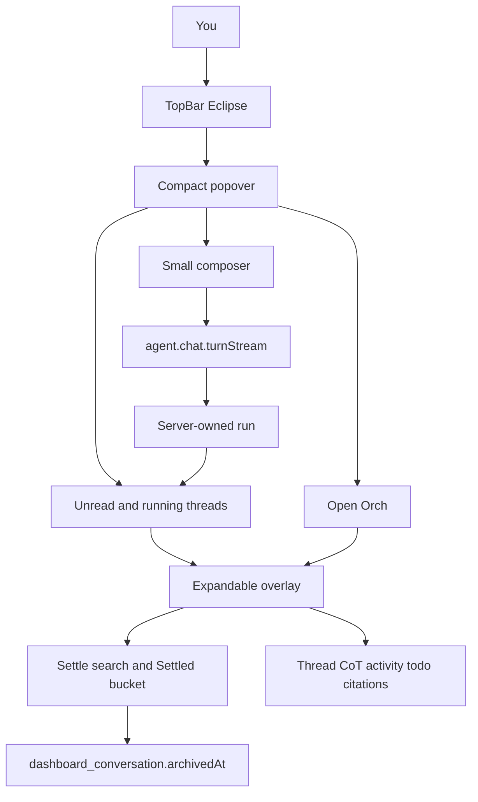

# Orch Top-Bar Companion Implementation Plan

> **For agentic workers:** After approval, save this as `docs/superpowers/plans/2026-09-16-orch-topbar-companion.md`, then implement slice-by-slice (subagent-driven or inline). Checkboxes below are the execution queue.

**Goal:** Orch lives in the top-bar utility slot. Click opens a compact glance, not the chat. Open Orch expands over the current Agency/Canvas page. Settle archives threads. Tool activity is readable. `/` and `@` are the command surface.

**Architecture:** Keep the durable run/memory/proposal backend. Replace only agent chrome and conversation hygiene. Compact list is a new query over existing `dashboard_conversation` plus `lastReadAt`. Settle reuses `archivedAt`. Expanded chat is a layoutId morph from the popover (cult-ui expandable-screen), not a new route.

**Tech Stack:** Existing golden-file agent stack, shadcn Popover/Sheet, motion layoutId, canvas-confetti (restrained), Vercel AI Elements already in `apps/web/src/components/ai-elements/`.

**Visitor mode:** Operate. Visual world: inherit [DESIGN.md](DESIGN.md) (quiet instrument, Restrained, Operator Violet on Eclipse bite-dot and working/needs-you only). This is a whole-surface chrome replacement inside an established world, not a new brand.

## Global Constraints

- Golden-file only. Views never call oRPC/stores/auth.
- Browser never imports `@orch/agent` barrel.
- No Ask/Plan/Agent tags, no tools catalog in `+`, no click-to-scope crosshair.
- No liquid glass. No blobatar library (Eclipse glyph is the presence face).
- Confetti only when the finished thread is the open expanded view; skip when `prefers-reduced-motion`.
- Do not restyle Agency, Canvas, Tracker, Bills, or the sidebar rail besides notification overflow.
- Conventional commits on `dev`. `bun run check`, `check-types`, `check:conventions`, `check:golden` when adding files.

---

## Locked product decisions

- **Topology:** Top-bar Eclipse only. Corner dock and overlay tabs (Chat | Inbox | History) go away. Eclipse may appear as presence inside compact/expanded (blobatar presence-avatar *behavior*: idle / working / unread / thinking on the Eclipse disc).
- **Notifications:** No bell. Sidebar featured Needs-action card remains the only in-app notification surface. Delivery prefs already live in [user-settings-modal-view.tsx](apps/web/src/features/user-settings/views/user-settings-modal-view.tsx) (Notifications pane); fold any bell-only focus/quiet-hours controls into that pane so they are not stranded.
- **Settle:** Thread hygiene. Settle archives a conversation (`archivedAt`). Compact list = unread + currently running (unsettled). Settled bucket is history. Unsettle restores.

## Shape brief (Operate)

1. **Job:** During Agency/Canvas work, glance whether Orch needs you or is running, send a short turn without opening a panel, settle finished threads, expand only when you want the full thread.
2. **Outcome:** Eclipse in the old bell slot. Badge = unread threads + running runs (not team-notification count). Compact submit starts/continues a run and shows it in the list. Open Orch morphs to a full overlay. Approve/Reject stay on the proposal card.
3. **Direction:** Notification-slot companion, not a second chat app. First viewport is the compact popover: input, live threads, one CTA. Memorable moment: Eclipse needs-you; click; send or open the running thread; settle when done.
4. **Anti-goals:** Corner FAB, Chat/Inbox/History tabs, tools dump in `+`, scope-picking mode, raw `[Calling]` / `
` JSON traces, auto-expand on every send, confetti on collapsed glance, changing DESIGN.md palette/type.
5. **States:** Empty compact (input + Open Orch), running row, unread row, error on Eclipse, settle confirmation, expanded loading, expanded finish+confetti, task-thread morph (top-bar Eclipse to thread Orch badge).
6. **Mobile:** Same top-bar slot as today's bell. Compact popover goes full-width; expand is already full-screen. No new bottom FAB.

## Approaches considered

- **A (ship this):** Glance popover + morph expand + Settle in expanded chrome. Matches the six product asks.
- **B:** Linear/Klaviyo command-palette overlay as the click target. Stronger composer, weaker unread/running inbox. Rejected.
- **C:** Compact is inbox-only; composer only after Open Orch. Contradicts "small input to submit." Rejected.

## Growth diagnosis of the incumbent (why this topology)

Current Eclipse corner + Chat/Inbox/History + `
` tool dumps:

- **Psych:** Corner entry is easy to miss; three panel tabs tax Act; raw tool JSON is a Psych subtraction.
- **B.I.A.S.:** Block fails (agent is not in expected top-right utility), Interpret fails (tool traces), Act fails (tabs + tools + scope), Store fails (no settle, no finish ritual).
- **C.L.E.A.R. (incumbent):** Copy 2, Layout 2, Emphasis 2, A11y 3, Reward 2 = **11/25**.
- **Antidotes in the new chrome:** Default Effect (compact shows only unread/running), Zeigarnik (unsettled list), Labor Illusion (CoT + activity, not JSON), Peak-End (restrained confetti only if expanded).

## Visual references (cite, do not clone)

Mobbin:

- [Pinterest web inbox popover](https://mobbin.com/screens/1131e032-c0ee-4f1b-9e66-207610d5192c) — compact list under a utility trigger
- [Langdock agent inbox](https://mobbin.com/screens/dc3adbc9-3ae0-45fd-9f43-c8ab60a19052) — unread agent completions
- [Dropbox Dash thinking + composer](https://mobbin.com/screens/b9fcba1b-7766-464b-bb03-47be0cab06bb) — collapsible thought above prose
- [Linear Ask composer](https://mobbin.com/screens/735580ba-5334-4377-8dd8-4338533d99af) — slash/skills in the input, not a tools dump
- [Cursor agent composer](https://mobbin.com/screens/0febde4f-4089-4c53-a831-04a7f745c2b2) — compact send bar

User list: Morphin compact AI input; Skiper `@` mention chips; blobatar presence *behavior* on Eclipse; Magic UI confetti (expanded only); cult-ui expandable-screen morph; AgentUI todo / loading / activity / citations; shadcn.io chain-of-thought. t3code Settle screenshot: search, Settle action, pending thread rows with source line, Settled (n) footer.

Open Design: first build step after approval is two complete compositional directions of compact + expanded (100% of features/actions, not showcase-only). User picks one. Then code reproduces that comp inside DESIGN.md tokens.

---

## File map

**Create**

- `packages/db/src/migrations/*_conversation_last_read.sql` — `last_read_at`
- `apps/web/src/features/workspace-agent/orch-topbar-trigger-view.tsx`
- `apps/web/src/features/workspace-agent/orch-compact-popover-view.tsx`
- `apps/web/src/features/workspace-agent/orch-expandable-screen-view.tsx`
- `apps/web/src/features/workspace-agent/orch-settle-list-view.tsx`
- `apps/web/src/features/workspace-agent/orch-tool-activity-view.tsx` (replaces dump traces)
- `apps/web/src/features/workspace-agent/orch-chain-of-thought-view.tsx`
- `apps/web/src/features/workspace-agent/orch-citations-view.tsx`
- `apps/web/src/features/workspace-agent/orch-todo-list-view.tsx`
- `apps/web/src/features/workspace-agent/orch-confetti.ts`
- `apps/web/src/features/workspace-agent/workspace-agent-commands.ts` + tests
- `packages/api/src/routers/agent/conversation-hygiene.ts` + tests (`settle`, `unsettle`, `markRead`, compact list)

**Modify**

- [apps/web/src/features/app-shell/app-shell-context-bar.tsx](apps/web/src/features/app-shell/app-shell-context-bar.tsx) — swap `AppShellNotifications` for Orch trigger
- [apps/web/src/features/app-shell/app-shell.tsx](apps/web/src/features/app-shell/app-shell.tsx) — keep host for overlay; trigger can stay in the bar
- [apps/web/src/features/workspace-agent/workspace-agent-view.tsx](apps/web/src/features/workspace-agent/workspace-agent-view.tsx) — kill corner pet + tabbed panel
- [apps/web/src/features/workspace-agent/hooks/use-workspace-agent.ts](apps/web/src/features/workspace-agent/hooks/use-workspace-agent.ts) — compact/expand/settle view model
- [apps/web/src/features/workspace-agent/workspace-agent-thread-composer-view.tsx](apps/web/src/features/workspace-agent/workspace-agent-thread-composer-view.tsx) — `+` = attach (+ Canvas knowledge). No tools, no scope
- [apps/web/src/features/workspace-agent/workspace-agent-mentions.ts](apps/web/src/features/workspace-agent/workspace-agent-mentions.ts) — `/` commands vs `@` entities
- [apps/web/src/features/workspace-agent/workspace-agent-thread-data-ui.tsx](apps/web/src/features/workspace-agent/workspace-agent-thread-data-ui.tsx) — activity / CoT / citations / todo
- [apps/web/src/features/notifications/featured-rail-notification-view.tsx](apps/web/src/features/notifications/featured-rail-notification-view.tsx) — `N more` must not open the dead bell; advance featured item or open a rail-anchored sheet
- [packages/db/src/schema/workspace.ts](packages/db/src/schema/workspace.ts) `dashboardConversation`
- [packages/agent/src/types.ts](packages/agent/src/types.ts) summary schema
- [packages/api/src/routers/agent/router.ts](packages/api/src/routers/agent/router.ts) + [service.ts](packages/api/src/routers/agent/service.ts)
- Task-thread morph: [orch-presence-morph.ts](apps/web/src/features/shared/orch-presence-morph.ts) + [agency-task-thread-composer-view.tsx](apps/web/src/features/task-management/...) — `layoutId` on top-bar Eclipse, hide compact while `orchPresence === "thread"`
- [PRODUCT.md](PRODUCT.md) operating context + [apps/web/.impeccable/surfaces/workspace-agent.md](apps/web/.impeccable/surfaces/workspace-agent.md)

**Kill (stop rendering / delete after replacement)**

- Fixed corner [eclipse-pet-view.tsx](apps/web/src/features/workspace-agent/eclipse-pet-view.tsx) as FAB (reuse SVG inside trigger)
- [orch-assistant-panel-view.tsx](apps/web/src/features/workspace-agent/orch-assistant-panel-view.tsx) tab IA
- [tool-menu-view.tsx](apps/web/src/features/workspace-agent/tool-menu-view.tsx) in `+`
- [use-agent-scope-mode-listener.ts](apps/web/src/features/workspace-agent/hooks/use-agent-scope-mode-listener.ts) click-to-scope
- [orch-tool-trace-view.tsx](apps/web/src/features/workspace-agent/orch-tool-trace-view.tsx) `
` + raw `pre` dumps

---

## Compact popover (click Eclipse)

Order, top to bottom:

1. **Small composer** — Morphin/Skiper density: one-line textarea, `+` attach, send. Submit does **not** auto-expand. Running row appears immediately.
2. **Thread list** — only unread (`lastMessageAt > lastReadAt`) and running (`activeRunId`). Title, one-line preview, running pulse or unread dot. Row click expands that thread.
3. **Open Orch** — primary text button; expands current/last thread or empty expanded chat.

Empty copy: "Nothing running." Keep the input and Open Orch.

Header of compact: Eclipse + optional search is **not** here (search lives in expanded Settle chrome, matching t3code).

## Expanded overlay (Open Orch / row click)

Cult-ui expandable-screen: morph from popover bounds to a large overlay over the current page (`z` above shell content, below nothing critical; artifact canvas can stay `z-60` on top of it).

Chrome cloned from t3code Settle, in Orch language:

- Search field
- **Settle** on the active thread (archives)
- Thread list: unsettled (running, unread, recently active)
- Footer **Settled (n)** disclosure for archived
- Main column: thread + composer
- Collapse control returns to compact (does not settle)

## Commands

`/` is verbs. `@` is nouns as animated mention chips (Skiper), **not** persistent scope-mode chips.

**Slash (minimum ship set)**

- `/new` start a new thread
- `/settle` archive current
- `/stop` cancel active run
- `/memory` show recent profile notes / add a note
- `/task` `/project` `/client` `/member` `/entry` insert an `@` entity chip of that kind

**At**

- `@` searches tasks, projects, clients, members, canvas nodes, time entries. Selecting inserts a chip that travels on the turn as structured context (today's `contextNodeTitles` / scope refs without the crosshair picker).

`+` menu: attach files; Canvas knowledge create may stay. Remove tools catalog and Add-to-scope.

## Tool / loading / todo / citations

Replace `OrchToolTraceView` with:

- **Chain of thought** (shadcn.io pattern): one collapsible "Thinking" block; steps are human labels from existing `TOOL_LABELS` in [thinking-activity-view.tsx](apps/web/src/features/workspace-agent/thinking-activity-view.tsx) (wire that into the live message list).
- **Agent activity:** quiet timeline of tool names + status; inspect payload only behind a further disclosure, never the default.
- **Loading:** Eclipse presence thinking indicator in-thread (blobatar behavior), plus AgentUI-style reasoning text using real tool labels, not scramble-for-show.
- **Todo:** stream a sanitized planner outline as a `data-orchTodo` part (planner today is hidden by [formatPlannerPlanForTools](packages/agent/src/planner.ts)). User-visible titles only; keep the internal routing note off-screen.
- **Citations:** `fetch_web_page` (and similar) results as citation chips under the answer.

Do not show raw `[Calling …]` / `[Tool result …]` in prose (already stripped; keep the stripper).

## Data / API

`dashboard_conversation` already has `archivedAt`. [listDashboardConversations](packages/api/src/routers/agent/service.ts) currently hides archived rows.

Add:

- `lastReadAt timestamptz null`
- Summary fields: `lastReadAt`, `archivedAt`, `activeRunId`, `unread` (derived)
- `agent.conversations.compact` — unread OR running, unsettled, small limit
- `agent.conversations.list` — add `filter: "open" | "settled"`
- `agent.conversations.settle` / `unsettle` (set/clear `archivedAt`)
- `agent.conversations.markRead` on expand/open
- Batch running-run lookup so compact list does not N+1

Mark read when the expanded thread is shown or the compact row is opened. Compact submit on a new thread marks it read for the sender.

Inbox `profile_note` rows: keep the API. Surface unread finish notes as compact rows when they have a `runId` (join to conversation). No Inbox tab.

## Task thread

When a task cover-slide opens: compact popover closes; top-bar Eclipse morphs to the in-thread Orch badge (`ORCH_PRESENCE_LAYOUT_ID`). Global compact/expand hidden while `orchPresence === "thread"`. Close thread morphs back to the top-bar slot.

## Confetti

`canvas-confetti` burst inside the expanded overlay only, when that conversation's run transitions to complete. Colors: paper/ink + Operator Violet `#5b5bd6`. No fireworks. No fire from compact.

---

### Task 1: Open Design comps (before product code)

**Files:** Open Design project, then stills into `.impeccable/` if needed.

- Two complete directions of compact popover + expanded Settle thread, each exposing 100% of actions (send, unread, running, Open Orch, Settle, Settled, `/` `@`, attach, CoT, activity, todo, citations, collapse).
- User picks one. Code reproduces that comp in DESIGN.md tokens.

### Task 2: Conversation hygiene API

**Files:** schema/migration, [packages/agent/src/types.ts](packages/agent/src/types.ts), [packages/api/src/routers/agent/service.ts](packages/api/src/routers/agent/service.ts), [router.ts](packages/api/src/routers/agent/router.ts), new tests.

- `lastReadAt`; settle/unsettle/markRead/compact list.
- Tests: fingerprint unread; settle hides from compact; unsettle restores; running conversation appears even if read.

### Task 3: Top-bar Eclipse + compact popover

**Files:** context bar, new trigger/popover views, hook view model, kill `AppShellNotifications` in the bar, rail `N more` no longer `requestOpenInbox()`.

- Eclipse ~32px in the 44px bar; moods from [eclipse-mood.ts](apps/web/src/features/workspace-agent/eclipse-mood.ts) using compact unread + running + pending proposals.
- Compact layout as specified. Browser-verify Agency and Canvas.

### Task 4: Expandable screen + Settle UI

**Files:** expandable view, settle list (reuse/adapt [thread-list.tsx](apps/web/src/components/elements/thread-list.tsx)), replace panel tabs.

- Morph popover to overlay. Search, Settle, Settled (n). Collapse returns to compact.

### Task 5: Composer commands; kill tools and scope

**Files:** mentions, composer view, trigger controls, delete/stop wiring tool menu and scope listener.

- Tests for `/` vs `@` parsing and command dispatch.

### Task 6: Thread interiors

**Files:** thread-data-ui, activity/CoT/todo/citations views, planner data part, confetti helper.

- Wire `ThinkingActivityView` into live messages. Kill `OrchToolTraceView` default dump.

### Task 7: Task-thread morph + kill corner dock

**Files:** presence morph, task composer, workspace-agent-view, PRODUCT.md, surface brief.

- Remove `fixed z-40` corner stack. Confirm `orchPresence === "thread"` hides top-bar compact.

### Task 8: Finish checks

- `bun run check` / `check-types` / `check:conventions` / `check:golden`
- Detector: `node .cursor/skills/impeccable/scripts/detect.mjs --json` on changed web UI
- Browser: Agency + Canvas, compact send, expand, settle, reopen Settled, running reconnect, task-thread morph, no bell, rail featured still works, reduced-motion no confetti

